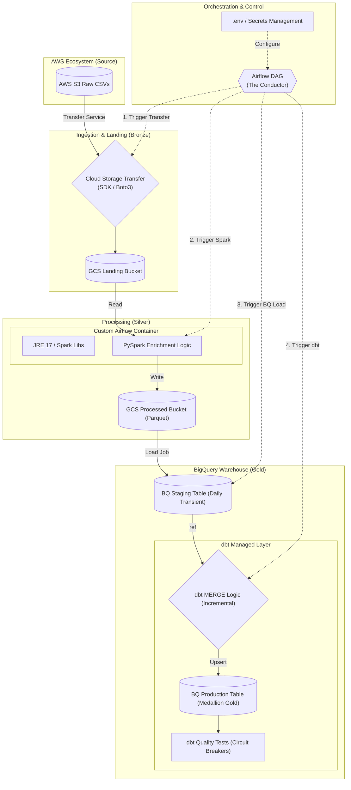

# 🏗️ Cloud Data Architecture: AWS to GCP Medallion Pipeline

This diagram illustrates the end-to-end flow of the e-commerce migration project, following a **Medallion Architecture** (Bronze ➔ Silver ➔ Gold) with a dedicated **Orchestration Layer**.

## 📊 System Architecture Diagram

---

## 🛠️ Component Breakdown (FOR INTERVIEW)

### 1. Ingestion (AWS ➔ GCP)
- **Tech**: GCS Transfer Service / Google Cloud SDK.
- **Narrative**: *"We treat AWS S3 as our immutable legacy source. We land data in GCS as-is to preserve raw history before any processing happens."*

### 2. Silver Layer (PySpark)
- **Tech**: Apache Spark 3.5.0.
- **Narrative**: *"Spark acts as our heavy-lifter. We perform complex deduplication and join orders with user segments here. We store the result in Parquet format to leverage columnar compression and schema preservation."*

### 3. Gold Layer (BigQuery & dbt)
- **Tech**: BigQuery + dbt-fusion.
- **Narrative**: *"We use the 'Staging-to-Production' design. dbt handles our incremental materialization, ensuring we only MERGE new data each night, significantly reducing BigQuery slot costs."*

### 4. Orchestration (Airflow & Docker)
- **Tech**: Apache Airflow 2.8.1 (LocalExecutor) + Custom Docker Image.
- **Narrative**: *"Airflow is the central nervous system. To ensure high availability and portability, we containerized the entire orchestration suite. Crucially, we extended the base Airflow image with OpenJDK 17 and Spark libraries, allowing high-performance PySpark jobs to run locally within the airflow-scheduler, ensuring that if any stage failed (like a 404 on a GCS bucket), the pipeline would halt and retry gracefully."*
