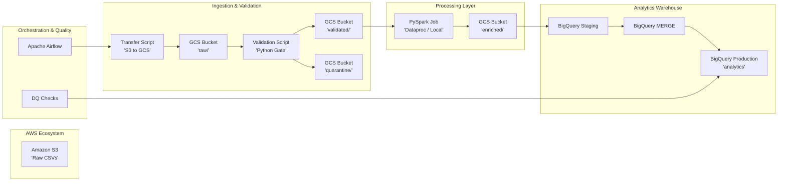

# 🏗️ Project Architecture & Service Mapping

This document provides a high-level overview of the end-to-end data migration architecture and how AWS services map to their Google Cloud (GCP) equivalents.

## 1. End-to-End Data Flow (Mermaid Diagram)

---

## 2. Cloud Service Mapping Table

| Component | AWS Service | GCP Service | Why the choice? |
| :--- | :--- | :--- | :--- |
| **Object Storage** | Amazon S3 | Cloud Storage (GCS) | Industry standard for data lakes; HDFS-compatible. |
| **Distributed Compute** | EMR / Glue | Dataproc | Managed Spark/Hadoop cluster; ideal for lift-and-shift migration. |
| **Data Warehouse** | Redshift | BigQuery | Serverless, highly scalable, and superior separation of storage/compute. |
| **Orchestration** | Managed Airflow (MWAA) | Cloud Composer | Native Airflow integration for complex DAG dependencies. |
| **IAM & Security** | AWS IAM | Cloud IAM | Built-in least-privilege access control across all resources. |
| **Monitoring** | CloudWatch | Cloud Logging / Monitoring | Centralized observability for job performance and failure metrics. |

---

## 3. Data Storage Layout (Best Practices)

We implemented a **Medallion-inspired** folder structure in GCS to ensure clear data lineage:

1.  `gs://...raw/`: Immutable landing zone for raw S3 files.
2.  `gs://...validated/`: Schema-verified files ready for processing.
3.  `gs://...quarantine/`: Corrupt or schema-mismatched files for manual audit.
4.  `gs://...processed/`: Enriched Parquet files (partitioned by `process_date`).
